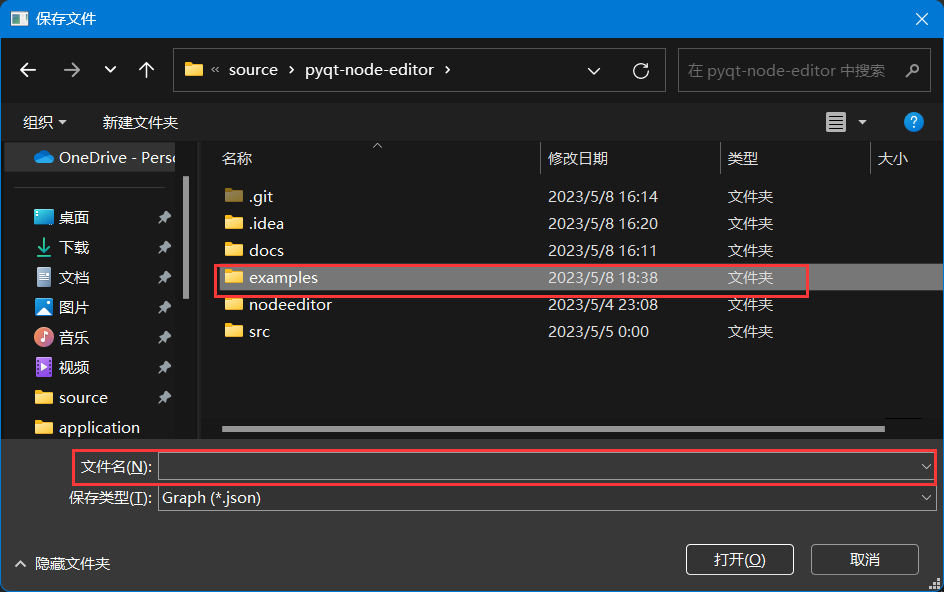

基于蓝图系统的人工神经网络可视化集成开发环境
=

[](https://gitee.com/zzc1024/Visual-ANN/stargazers)

[](https://gitee.com/zzc1024/Visual-ANN/members)

[](https://gitee.com/zzc1024/Visual-ANN)

毕业设计作品~

目前正在编码中，尚未完成。

# 软件介绍

## 总体预览图


点击菜单栏，弹出如下窗口：


点击“新建”来创建第一个节点编辑器窗口：


在上图中，总共有四个区域：

1. **菜单栏**。该部分由多个菜单栏构成。其中的大部分操作有快捷方式，常用的文件操作功能在“文件”栏中。

2. **节点编辑器**。该部分可以同时存在多个编辑场景且相互不冲突，但是同一个文件无法被多次打开。鼠标左键操作节点，鼠标中建移动视角和缩放视角，鼠标右键打开菜单。该部分的节点可以由部分3“节点列表”中直接拖拽获取。

3. **节点列表**。该部分提供了多种内置的节点可供用户选择。目前的状态只能做检点的卷积神经网络。该窗口如果消失，可以从部分1中的“窗口菜单栏中选择”节点列表“即可打开。

4. **状态栏**。提示用户当前的状态或者某些操作。

## 搭建模型

以keras官网上的A toy ResNet为例，实现一个如下图所示的简单ResNet模型。

[](https://keras.io/guides/functional_api/#a-toy-resnet-model)

其实现代[码如](https://keras.io/guides/functional_api/#a-toy-resnet-model)下：

```python3
import keras
from keras import layers
inputs = keras.Input(shape=(32, 32, 3), name="img")
x = layers.Conv2D(32, 3, activation="relu")(inputs)
x = layers.Conv2D(64, 3, activation="relu")(x)
block_1_output = layers.MaxPooling2D(3)(x)

x = layers.Conv2D(64, 3, activation="relu", padding="same")(block_1_output)
x = layers.Conv2D(64, 3, activation="relu", padding="same")(x)
block_2_output = layers.add([x, block_1_output])

x = layers.Conv2D(64, 3, activation="relu", padding="same")(block_2_output)
x = layers.Conv2D(64, 3, activation="relu", padding="same")(x)
block_3_output = layers.add([x, block_2_output])

x = layers.Conv2D(64, 3, activation="relu")(block_3_output)
x = layers.GlobalAveragePooling2D()(x)
x = layers.Dense(256, activation="relu")(x)
x = layers.Dropout(0.5)(x)
outputs = layers.Dense(10)(x)

model = keras.Model(inputs, outputs, name="toy_resnet")
model.summary()
```

ResNet是残差神经网络，它的核心为残差网络结构，该结构如下图所示：

[](https://zhuanlan.zhihu.com/p/349717627)

我们首先要做的是设计基本的残差网络结构。

我们通过拖动如下图所示的拖拽方式，来获取一个简单的2D卷积节点。
虽然节点上并没有标注每行内容是什么用途，但是可以通过鼠标悬停来获取提示。

从上到下这三个整数输入框分别为filters，KernelSize，strides。
最下面的选择框代表padding方式。


在本示例中，似乎只提供了前两个参数，其它参数可以考虑是keras API的默认值。
可以[查阅keras的官方文档](https://keras.io/api/layers/convolution_layers/convolution2d/)
来获取提示。

经过查阅，前三个参数分别为32、3和1，padding为valid。

官方代码中还提供了activation选项，虽然在该节点中不存在这个参数选项，
但是可以从节点列表中选取激活函数加上：

加上之后如下图所示：


不要忘了将两个节点前后连接起来。

激活函数节点的下面有一个参数选项，该数值为0，不可以随意更改，
否则就变成了Leaky ReLU函数了。

鼠标左键选取这些部分，并按下”Ctrl + C“复制这个基本的卷积节点组合。


之后按下”Ctrl + V“粘贴复制得到的内容，然后将这两个节点组连接起来。

这样就得到了一个基本的残差结构小节点组。


将这个小节点组复制成三份，并在第一个节点组后面加上一个池化节点， 调成最大值池化（MaxPool2D）。
将第二个参数poolSize为3，第三个参数padding为same，第四个参数strides为1。
另外两个节点组后面加上Add层（后期将会改为Merge节点）。
将各节点组与新添加的节点连起来，最终效果如下图所示：


每一级首尾相连，然后让Add节点连接其前方的激活函数和上一级的最后一个节点。
这是残差神经网络的重要一部分。 其结果如下图所示：


然后在最后一个节点后面加上ResNet剩余的部分。并对前面错误的参数就行修改。
（是我懒得再截图了，具体内容看最终截图吧）


上图中的节点左上角变成了绿色。这是因为之前没有输入层，导致这些节点全是不完整的，
成为了脏节点。在加入输入层后，这些节点内容被完善，因此变成了绿色的正确标识。

## 保存项目

在菜单栏中选择”文件“->”保存“或者按下”Ctrl + S“可以保存当前项目。如下图所示：



选择好要保存的位置并填写文件名称后即可保存。

**注意：** 再次打开软件的时候可能会出现节点全是无效的状态，
这可能是由于未知bug或者是因为本软件使用的框架采取惰性计算的原因导致的。
当重新加载遇到如下图的情况时，可以右键点击一个无效节点，点击计算该节点即可。


## 模型操作

对模型的操作有三种方式，分别为编译、保存和检视。


### 编译

编译总共有两个参数，分别为代价函数和优化器。

### 保存

保存节点只有一个按钮，按下按钮后会出现选择保存路径的选项：


新建一个文件夹并为其命名，该文件夹将会保存模型的信息。

**注意：** 不要以”.keras“或”.h5“为文件夹的结尾，这会自动生成单一文件模型，
并且这种文件无法被本软件识别。

### 检视

该功能由展示节点实现：


点击”模型摘要“，可以获取纯文本的模型摘要文件。


点击”模型结构图“，可以获得模型的图结构。


图片会临时存储在`src/application/tmp.png`目录下
